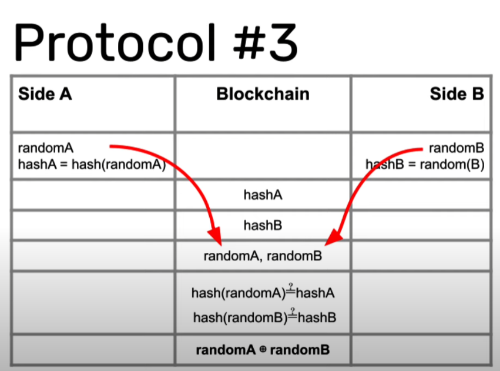

# Optimism Casino Betting Game

## This project includes:

* How to build a sample application: a betting game
* Transacting with a rollup
* Implement a new gaming protocol (Protocol#3) to protecting from frontrunning
* How to deploy to Optimism testnet AND mainnet

----

Contract address (in Kovan Optimism network): 
0xb510c7B0F92528fD54189e11F47344feEC9007bc
https://kovan-optimistic.etherscan.io/address/0xb510c7B0F92528fD54189e11F47344feEC9007bc

----

## Open issues & tweaks:

* ~~// TODO: implement Protocol#3~~
* Include Protocol#3 tests in casino-test.js
* Verify hashA == hash(ramdomA) && hashB == hash(ramdomB)

----

[Click here for a detailed explanation](https://blog.logrocket.com/build-random-number-generator-blockchain/)
